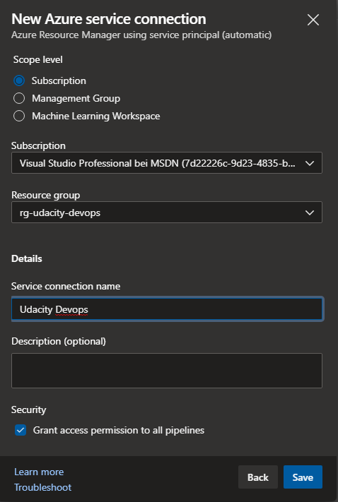
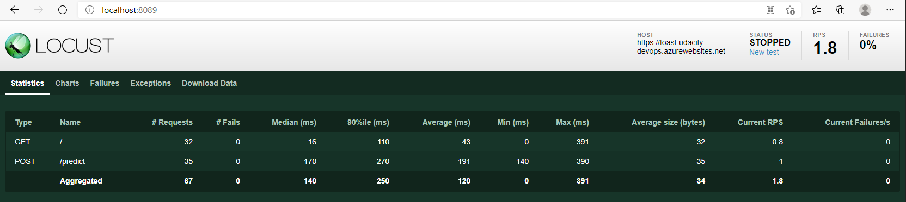

[](https://github.com/manuel284/Udacity-Building-a-CI-CD-Pipeline/actions/workflows/pythonapp.yml)

# Overview

In this project, we
* clone a GitHub repo to Azure Cloud Shell,
* setup pylint and pytest to run in a GitHub action,
* deploy the webapp using Azure CLI,
* setup a CI/CD pipeline in Azure DevOps,
* run a load test with Locust.


## Project Plan

* [Trello Board](https://trello.com/b/7E52uJeg/udacity-building-a-ci-cd-pipeline)

* [Project Plan](https://docs.google.com/spreadsheets/d/1upfoYk2llhbB5BGs1W-Y3U2vmln8hDHQUxTRWsh1REw/edit?usp=sharing)

## Instructions

### Clone the repository from github
* using https: `git clone https://github.com/manuel284/Udacity-Building-a-CI-CD-Pipeline.git`
* using ssh
    1. create an ssh key: `ssh-keygen -t rsa`
    
    2. copy the value of the key: `cat /home/manuel/.ssh/id_rsa.pub`
    
    3. add the key to your github account: https://github.com/settings/keys 
    
    
    4. git clone: `git clone git@github.com:manuel284/Udacity-Building-a-CI-CD-Pipeline.git`
    

### Run app locally
1. change directory: `cd Udacity-Building-a-CI-CD-Pipeline/`
2. create virtual environment: `make setup`
3. activate virtual environment: `source ~/.udacity-devops/bin/activate`
4. install dependencies, and run lint and tests: `make all`
<br/>

5. run the app: `python app.py`
6. open a new shell and test the app: `source make_prediction.sh`


### Deploy app to Azure App Service
1. create a new resource group: `az group create -n rg-udacity-devops -l "west europe"`
2. deploy the web app: `az webapp up -g rg-udacity-devops -l "west europe" --sku F1 -n toast-udacity-devops`

### Test the deployed app
1. Update make_predict_azure_app.sh to call the correct URL

3. open the url in your web browser: https://toast-udacity-devops.azurewebsites.net

2. run make_predict_azure_app.sh: `source make_predict_azure_app.sh`

3. check the output of your web app's logstream


### Setup Continuous Integration in github
1. Go to the repo in github - Actions - New workflow - set up a workflow yourself.
2. Paste the following code and click `start commit`:
```
name: Python application test with Github Actions

on: [push]

jobs:
  build:

    runs-on: ubuntu-latest

    steps:
    - uses: actions/checkout@v2
    - name: Set up Python 3.7
      uses: actions/setup-python@v1
      with:
        python-version: 3.7
    - name: Install dependencies
      run: |
        make install
    - name: Lint with pylint
      run: |
        make lint
    - name: Test with pytest
      run: |
        make test
```

3. Go to Actions and find the build that was triggered automatically by your commit.


### Setup a new Azure DevOps project
1. Go to https://dev.azure.com/ and click on `+ New Project`

2. Add a new service connection: Project Settings - Service connections - Create service connection; Select `Azure Resource Manager`

3. Select `Service principal (automatic)`, choose your subscription, the resource group you created earlier and define a service connection name


### Setup continuous integration and continuous delivery in Azure DevOps
1. Go to Pipelines - Create Pipeline and select GitHub

2. Select our repository

3. run pipeline


### Load test the application
1. Install locust on your local machine: `pip install locust`
2. run locust: `locust`
3. open locust in your web browser: http://localhost:8089/
4. run the test<br/>




## Enhancements

The repository only has a main branch. In the future, we should work with feature branches and only add changes to the main branch using pull requests.

The web app runs on an Azure App Service. For scaling purposes, we can deploy the code to Azure Kubernetes Service.

pytest and pylint are not used for the web app. These steps should be added to the continuous integration.

## Demo 

<TODO: Add link Screencast on YouTube>


